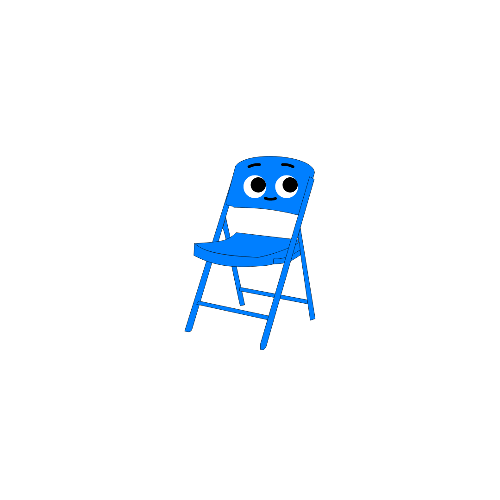

# Folding Chair

Folding Chair is a .NET code-virtualization based obfuscation engine that implements theory presented in a paper titled '[Virtual Code Folding](https://ieeexplore.ieee.org/abstract/document/9151995/)'.

[Showcase](#showcase) •
[Features](#features) •
[Usage](#usage) •
[License](#license) •
[Credits](#credits)

## Showcase

TBD

## Features

TBD

## Usage

TBD

## License

This repository uses the MIT license. 

## Credits

- The authors of ['Virtual Code Folding'](https://ieeexplore.ieee.org/abstract/document/9151995/).
- [KoiVM](https://github.com/yck1509/KoiVM). Hear me out before you scream 'KoiVM Paste!!' . . the way they organized their virtualizer over there was very nice. So heavy inspiration from that. If you see similar elements, let the record state I am not pasting from Koi, and instead am just organizing under the same general structure. tl;dr this is not KoiVM.
